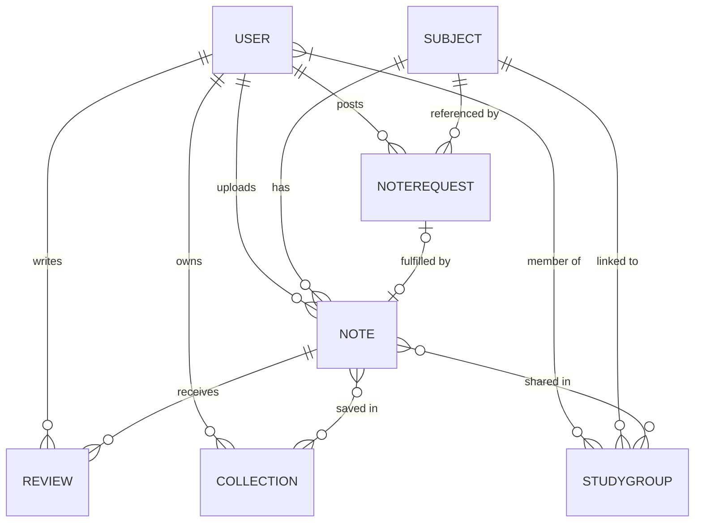

# UniVault – Full Stack Mobile App

A collaborative student note-sharing platform built with **React Native (Expo)** + **Node.js/Express** + **MongoDB (Mongoose)**.

---

## ✅ Phase 1 Complete — Mongoose Schemas (7 Models)

All model files are created at `backend/models/`. Below is the complete ERD and design rationale.

---

## Entity Relationship Overview



---

## Schema Design Details

### 1. `User.js`
| Field | Type | Notes |
|---|---|---|
| `name` | String | Required, max 100 |
| `email` | String | Unique, lowercase |
| `password` | String | `select: false` — never returned in queries |
| `avatar` | String | File URL (Multer) |
| `university` | String | |
| `batch` | String | e.g. `"SE2020"` |
| `role` | `enum['student','admin']` | defaults `student` |
| `isActive` | Boolean | Soft-delete flag |
| `studyGroups` | `[ObjectId → StudyGroup]` | |
| **virtuals** | `notes`, `collections` | Populated on demand |

---

### 2. `Subject.js`
| Field | Type | Notes |
|---|---|---|
| `name` | String | Required, unique |
| `code` | String | Uppercased, e.g. `"CS3012"` |
| `description` | String | |
| `department` | String | |
| `semester` | Number | 1–12 |
| `createdBy` | `ObjectId → User` | Required |
| **virtual** | `notes` | All notes for this subject |

---

### 3. `Note.js` *(Core Entity)*
| Field | Type | Notes |
|---|---|---|
| `title` | String | Required |
| `description` | String | |
| `fileUrl` | String | Required — Multer path |
| `fileType` | `enum['pdf','image','docx','other']` | |
| `fileSize` | Number | bytes |
| `originalFileName` | String | |
| `subject` | `ObjectId → Subject` | Required, indexed |
| `uploadedBy` | `ObjectId → User` | Required, indexed |
| `averageRating` | Number | Cached, updated by Review hooks |
| `totalReviews` | Number | Cached |
| `tags` | `[String]` | lowercase |
| `isPublic` | Boolean | |
| `viewCount` | Number | |
| `downloadCount` | Number | |
| **index** | `text` on `title, description, tags` | Search |
| **virtual** | `reviews` | |

---

### 4. `Review.js`
| Field | Type | Notes |
|---|---|---|
| `note` | `ObjectId → Note` | Required, indexed |
| `reviewer` | `ObjectId → User` | Required, indexed |
| `rating` | Number | 1–5, required |
| `comment` | String | |
| **compound index** | `{ note, reviewer }` unique | One review per user per note |
| **post-save hook** | `calcAverageRating()` | Updates Note.averageRating + totalReviews |
| **post-delete hook** | `calcAverageRating()` | Keeps Note stats accurate |

> [!IMPORTANT]
> The `calcAverageRating` static method runs automatically — no manual update needed in controllers.

---

### 5. `NoteRequest.js`
| Field | Type | Notes |
|---|---|---|
| `title` | String | Required |
| `description` | String | |
| `subject` | `ObjectId → Subject` | Optional |
| `requestedBy` | `ObjectId → User` | Required |
| `status` | `enum['open','fulfilled','closed']` | defaults `open` |
| `fulfilledByNote` | `ObjectId → Note` | Set when fulfilled |

---

### 6. `Collection.js` *(Bookmarks)*
| Field | Type | Notes |
|---|---|---|
| `name` | String | Required |
| `description` | String | |
| `owner` | `ObjectId → User` | Required, indexed |
| `notes` | `[ObjectId → Note]` | Add/remove via `$addToSet` / `$pull` |
| `isPrivate` | Boolean | defaults `true` |
| **virtual** | `noteCount` | `notes.length` |

---

### 7. `StudyGroup.js`
| Field | Type | Notes |
|---|---|---|
| `name` | String | Required |
| `description` | String | |
| `subject` | `ObjectId → Subject` | Optional |
| `batch` | String | e.g. `"SE2020"` |
| `createdBy` | `ObjectId → User` | Required |
| `privacy` | `enum['public','private']` | |
| `members` | `[{user, role, joinedAt}]` | Embedded sub-schema, `role: admin/member/pending` |
| `sharedNotes` | `[ObjectId → Note]` | |
| `coverImage` | String | File URL |
| `isActive` | Boolean | |
| **virtual** | `memberCount` | Excludes pending members |

---

## Proposed Next Steps (Phase 2 — Backend)

### Backend Setup
#### [MODIFY] [package.json](file:///c:/Users/sheha/OneDrive/Desktop/APP/UniVault/backend/package.json)
Add all required dependencies: `express`, `mongoose`, `bcryptjs`, `jsonwebtoken`, `multer`, `dotenv`, `cors`, `express-validator`.

### New Files to Create
```
backend/
├── server.js              ← Entry point
├── config/
│   └── db.js              ← MongoDB connection
├── middleware/
│   ├── auth.js            ← JWT protect & authorize middleware
│   ├── errorHandler.js    ← Global error handler
│   └── upload.js          ← Multer config
├── controllers/
│   ├── authController.js
│   ├── noteController.js
│   ├── subjectController.js
│   ├── reviewController.js
│   ├── noteRequestController.js
│   ├── collectionController.js
│   └── studyGroupController.js
├── routes/
│   ├── authRoutes.js
│   ├── noteRoutes.js
│   ├── subjectRoutes.js
│   ├── reviewRoutes.js
│   ├── noteRequestRoutes.js
│   ├── collectionRoutes.js
│   └── studyGroupRoutes.js
└── models/                ← ✅ Already done
```

---

## Verification Plan

### Manual Verification (Phase 1 — Schemas)
Since there's no test suite yet, schema correctness can be verified by:

1. Install deps: `cd backend && npm install mongoose`
2. Start a Node REPL in `backend/`: `node`
3. Run: `require('./models/User')` — should return the compiled model without errors
4. Repeat for each model file

### Automated Tests (Phase 2 — after backend is built)
- A Jest + Supertest integration test suite will be set up with an in-memory MongoDB (`mongodb-memory-server`)
- Each module will have its own test file covering all CRUD endpoints
